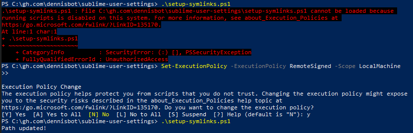

# sublime-user-settings
This repository holds my personal/favorite configuration files within my User folder along with a custom Git plugin (tweaked version from https://github.com/kemayo/sublime-text-git)

User folder location: (Preferences -> Browse Packages ...) then go inside `User` folder in order to see the content.

Thanks to this repository I'll be able to share my preferences among any other instance of sublime I might be running over
different OSs.

1. First of all, install `Sublime` and Sublime `Package Control` (Ctrl+Shift+P and type `Install Package Control`)

  <div style="margin-left: 40px;">
    
  </div>

2. Keep Sublime Text App Closed for convenience.

3. Run `setup-symlinks.ps1` in powershell with admin rights:

  ```powershell
  PS C:\gh.com\dennisbot\sublime-user-settings> .\setup-symlinks.ps1
  ```

  <div style="margin-left: 40px;">
    <p>In case you get the following error:</p>
    
    <p>Fix it by running:</p>
  </div>

  ```powershell
  Set-ExecutionPolicy -ExecutionPolicy RemoteSigned -Scope LocalMachine
  ```
  <div style="margin-left: 40px;">
    <p>And go to step 3 again.</p>
  </div>
  

4. Open up Sublime, it will automatically start to download any missing package (due to the new file linkages we have created), Sublime will know it has to install the missing packages, let's wait for it, in case something goes wrong (Sublime might change some files on its own), you can checkout any changes in this repo so that the original configs will be used (the files in this repo are symlinked that's why changes can be done here and will be propagated in Sublime configs).

Please, be aware that the name of `Default (Windows).sublime-keymap`
file [will be different across different OS](http://sublimetext.info/docs/en/reference/key_bindings.html)
(in case the target OS is MacOS or Linux), so it's better to have three different files with the same content among them, just duplicate the file and rename it according to your
target OS.
